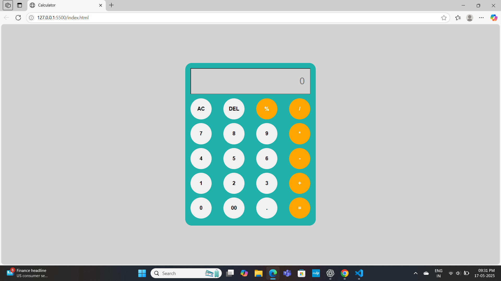

# Calculator-JS

A simple and responsive calculator application built using **HTML**, **CSS**, and **JavaScript**. This project demonstrates DOM manipulation, event handling, and responsive design techniques in vanilla JavaScript.

## Features

* Basic arithmetic operations: Addition, Subtraction, Multiplication, and Division.
* Responsive design for both desktop and mobile views.
* Clear (AC) and Delete (DEL) functionality for efficient input handling.
* Error handling for invalid calculations.

## Project Structure

```
Calculator-JS/
│
├── index.html       # Main HTML structure
├── style.css        # CSS styles
├── script.js        # JavaScript logic
└── README.md        # Project documentation
```

## Technologies Used

* **HTML** for structuring the application.
* **CSS** for styling and responsive design.
* **JavaScript** for event handling and dynamic DOM manipulation.

## How to Run the Project

1. Clone the repository:

   ```bash
   git clone <repository-url>
   ```
2. Navigate to the project directory:

   ```bash
   cd Calculator-JS
   ```
3. Open `index.html` in your browser:

   ```bash
   open index.html
   ```

Alternatively, you can use Live Server in VS Code for real-time changes.

## Usage

* Click on the number and operator buttons to form expressions.
* Press `=` to evaluate the expression.
* Use `AC` to clear the display and `DEL` to delete the last entry.

## Screenshots



## License

This project is open-source and available under the [MIT License](LICENSE.txt).

## Contributing

Feel free to open issues or submit PRs for improvements and bug fixes. Contributions are always welcome!

